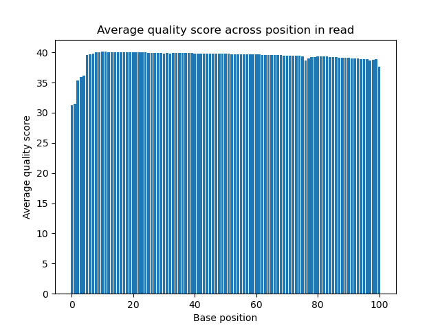
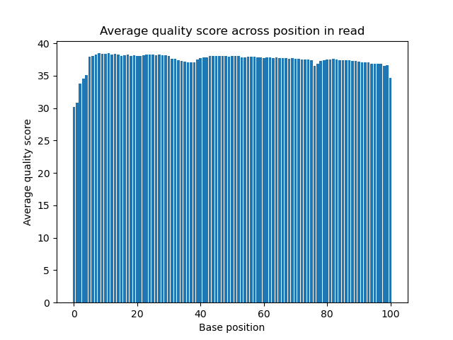
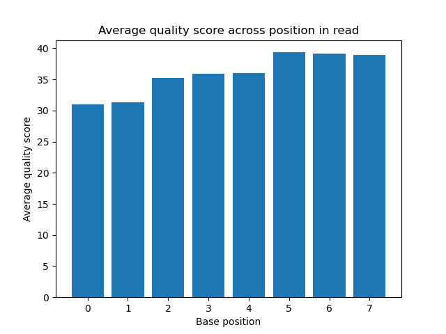
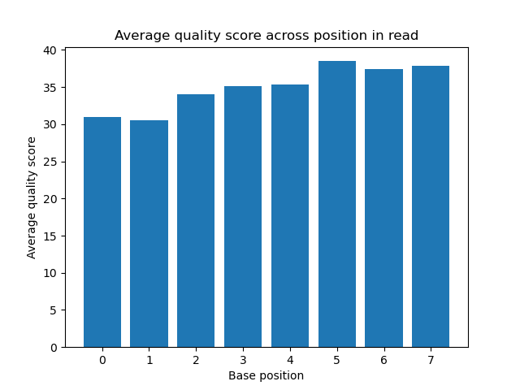

# Assignment the First

## Part 1
1. Be sure to upload your Python script.
```
Data exploration:
(base) [bmeluch@n278 2017_sequencing]$ zcat 1294_S1_L008_R1_001.fastq.gz | head | less -S
(base) [bmeluch@n278 2017_sequencing]$ zcat 1294_S1_L008_R2_001.fastq.gz | head | less -S
(base) [bmeluch@n278 2017_sequencing]$ zcat 1294_S1_L008_R3_001.fastq.gz | head | less -S
(base) [bmeluch@n278 2017_sequencing]$ zcat 1294_S1_L008_R4_001.fastq.gz | head | less -S

File lengths:
(base) [bmeluch@n278 2017_sequencing]$ zcat 1294_S1_L008_R1_001.fastq.gz | wc -l
1452986940
1452986940/4 = 363,246,735 records
```

| File name | label | Read length | Phred encoding |
|---|---|---|---|
| 1294_S1_L008_R1_001.fastq.gz | read1 | 101 | Phred+33 |
| 1294_S1_L008_R2_001.fastq.gz | index1 | 8 | Phred+33 |
| 1294_S1_L008_R3_001.fastq.gz | index2 | 8 | Phred+33 |
| 1294_S1_L008_R4_001.fastq.gz | read2 | 101 | Phred+33 |

2. Per-base NT distribution
    1. Use markdown to insert your 4 histograms here.

        Read 1 quality histogram
        
        

        Read 2 quality histogram
        
        

        Index 1 quality histogram
        
        

        Index 2 quality histogram
        
        

    2. Quality score cutoff
    ```
    A good quality score cutoff is an average Phred score of 30. A score of 30 translates to a 1 in 1,000 probability of an incorrect base call, or 99.9% accuracy. Q30 is a common quality standard, especially for Illumina runs, which often display a quality graph showing Q30 as a dotted line for you to quickly assess your data.
    ```
    3. How many indexes have undetermined (N) base calls?
    ```
    (done in slurm script)

    /usr/bin/time -v zcat /projects/bgmp/shared/2017_sequencing/1294_S1_L008_R2_001.fastq.gz | \
    grep -A 1 "^@" | grep -v "^@" | grep -c "N"

    /usr/bin/time -v zcat /projects/bgmp/shared/2017_sequencing/1294_S1_L008_R3_001.fastq.gz | \
    grep -A 1 "^@" | grep -v "^@" | grep -c "N"

    Indices with 'N' base calls:
    Index 1: 3976613
    Index 2: 3328051
    Total: 7297464
    ```
    
## Part 2
1. Define the problem
```
The end goal of the project is to measure the number of reads with swapped and unknown indices in this sequencing run, before and after filtering reads for index quality. The goal of the first part of the project is to read the FASTQ files, separate records out by matched/unmatched/unknown index pairs, and save the records to demultiplexed output files.
```
2. Describe output
```
- 24 FASTQ files containing read1 records for which index1 and index2 sequences matched and are in the list of known indices ("matched reads")
- 24 FASTQ files containing read2 records for which index1 and index2 sequences matched and are in the list of known indices ("matched reads")
- 1 FASTQ file containing read1 records for which index 1 and index2 sequences were in the list of known indices but did not match each other ("index hopped reads")
- 1 FASTQ file containing read2 records for which index 1 and index2 sequences were in the list of known indices but did not match each other ("index hopped reads")
- 1 FASTQ file containing read1 records for which one or both indices were not in the list of known indices, contained an N (unknown base), or had an average quality score below 30 ("unknown reads")
- 1 FASTQ file containing read2 records for which one or both indices were not in the list of known indices, contained an N (unknown base), or had an average quality score below 30 ("unknown reads")
- Counts of:
    Number of matched read-pairs (24 pairs)
    Number of index-hopped read pairs (# of counts dependent on what mismatches are found)
    Number of unknown read pairs (1 count)
```
3. Upload your [4 input FASTQ files](../TEST-input_FASTQ) and your [>=6 expected output FASTQ files](../TEST-output_FASTQ).
4. Pseudocode
    ```
    See pseudocode.txt
    ```
5. High level functions. For each function, be sure to include:
    1. Description/doc string
    2. Function headers (name and parameters)
    3. Test examples for individual functions
    4. Return statement

    ```

    qual_score(quality: string)
    """Takes a Phred score string and returns the average quality score of the string as a float."""
    return avg_score

    Test
        Input: "12345"
        Output: 51.

    write_demux_fastq(header: string, record: string, index1: string, index2: string, read: int, case: int)
    """Takes record information, index sequences, and case (0: matched, 1: unknown, 2: hopped) and writes record to the correct demultiplexed FASTQ file."""
    pass

    Test
        Input: ("@header_info", "sequence\n+\nquality\n", "ATAGC", "ATAGC", 1, 0)
        Output: Function returns nothing. Record is written to output file "Read1_Matched_ATAGC-ATAGC.fastq"

    rev_comp(seq: string)
    """Given a nucleotide string, returns the reverse complemented string."""
    return rc_seq

    Test
        Input: "GATTACA"
        Output: "TGTAATC"
    ```