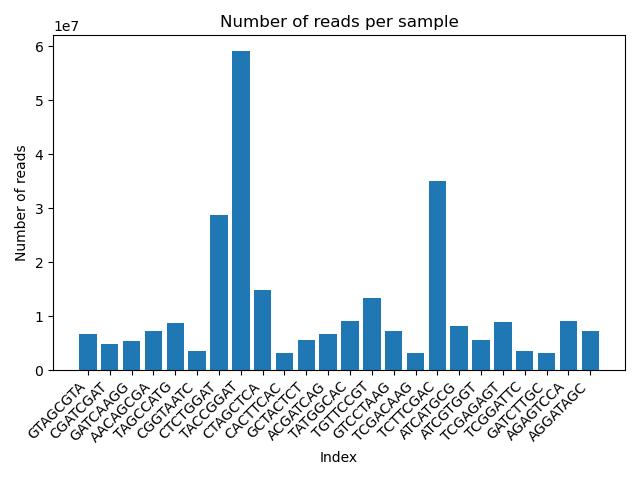
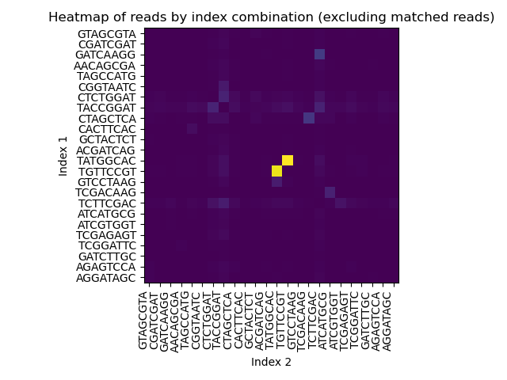

# Demultiplexing Summary
### Bea Meluch, BI622, 12 August 2022

* Demultiplexing and file zipping was performed by ```Demultiplex/Assignment-the-third/demultiplex.py```. 

* Counts for reads in each category were output to ```Demultiplex/Assignment-the-third/output/Demux_Output.txt```.

* Counts for each index pair were output to ```Demultiplex/Assignment-the-third/output/Index_Counts.tsv```.

* Plots and additional math were done by ```Demultiplex/Assignment-the-third/demux_calcs.py``` using ```Demux_Output.txt``` and ```Index_Counts.tsv```.

* ```demultiplex2.py``` can be disregarded, I was trying out a different index correction method to see if it would be faster.
 
## Read counts by category

From ```Demux_Output.txt```:

```
    Total reads with matched indices:	268193924
    Total reads with hopped indices:	416466
    Total reads with unknown indices:	94636345  *
        Total reads with unrecognized indices:	26964596
        Total reads with quality failed indices:	67671749
    Total reads written to files:	363246735
```
\* "Total reads with unknown indices" is the sum of "unrecognized" and "quality failed" indices (two indented lines).

From ```demux_calcs.py```:

```
    Percentage of reads with matched indices: 73.83 %
    Percentage of reads with hopped indices: 0.11 %
    Percentage of reads with unknown indices: 26.05 %
         Percentage of reads with unrecognized indices: 7.42 %
         Percentage of reads with quality failed indices: 18.63 %
```

## Matched Index Pairs



* Indices 'CTCTGGAT', 'TACCGGAT', and 'TCTTCGAC' have eaten up most of the reads
* Other samples are hovering under 10 million reads per sample

| Index | Read count | Percentage of matched reads |
|---|---|---|
GTAGCGTA | 6687193 | 2.49
CGATCGAT | 4804641 | 1.79
GATCAAGG | 5397408 | 2.01
AACAGCGA | 7243761 | 2.7
TAGCCATG | 8751449 | 3.26
CGGTAATC | 3554041 | 1.33
CTCTGGAT | 28673099 | 10.69
TACCGGAT | 59072947 | 22.03
CTAGCTCA | 14921008 | 5.56
CACTTCAC | 3233197 | 1.21
GCTACTCT | 5483667 | 2.04
ACGATCAG | 6767118 | 2.52
TATGGCAC | 9024175 | 3.36
TGTTCCGT | 13432181 | 5.01
GTCCTAAG | 7272561 | 2.71
TCGACAAG | 3117155 | 1.16
TCTTCGAC | 34970711 | 13.04
ATCATGCG | 8227480 | 3.07
ATCGTGGT | 5609274 | 2.09
TCGAGAGT | 8989830 | 3.35
TCGGATTC | 3539195 | 1.32
GATCTTGC | 3104746 | 1.16
AGAGTCCA | 9139457 | 3.41
AGGATAGC | 7177630 | 2.68

## Index Hopping

* Overall index hopping was low (0.11% of reads as seen above)
* Full list of counts for each index pair is saved in ```Index_Counts.tsv```.



* The most index hopping was seen between indices TGTTCCGT and TATGGCAC (yellow squares on heatmap):

    | index1 | index2 | reads |
    |---|---|---|
    | TGTTCCGT | TATGGCAC | 68402 |
    | TATGGCAC | TGTTCCGT | 70551 |

* Indices TGTTCCGT and TATGGCAC were not among the three samples with the highest number of reads (see above).

* Indices TGTTCCGT and TATGGCAC correspond to these two samples:

    | sample | group | treatment | index | sequence|
    |---|---|---|---|---|
    | 17 | 3E | fox | B7 | TATGGCAC |
    | 19 | 3F | fox | A3 | TGTTCCGT |

* Total hopped reads from these two samples: 138953

* Total hopped reads in run (from above): 416466

* These two samples account for 33.36% of all index hopping in this run.

(Full disclosure, I did sort Index_Counts.tsv in Excel using the order of sample IDs in indexes.txt to make the heatmap. Couldn't get it to work in Python. Raw output from my demux script is renamed to Index_Counts_raw.tsv.)

## Confirming record counts

Line counts for input and output FASTQ files were obtained using ```Demultiplex/Assignment-the-third/slurm/fastq_line_counts.srun``` and saved in ```Demultiplex/Assignment-the-third/output/FASTQ_Line_Counts.txt```.

* Total records in input FASTQ files (read1 + read2) = 726493470

* Total records in output FASTQ files(read1 + read2) = 726493470

* Total records / 2 = 363246735

* Internal counters (matchcount + unkcount + qualcount + hoppedcount): 363246735

* Internal counter of records written to files (rcount): 363246735

All read1 and read2 records were written to output files, no records were lost.
